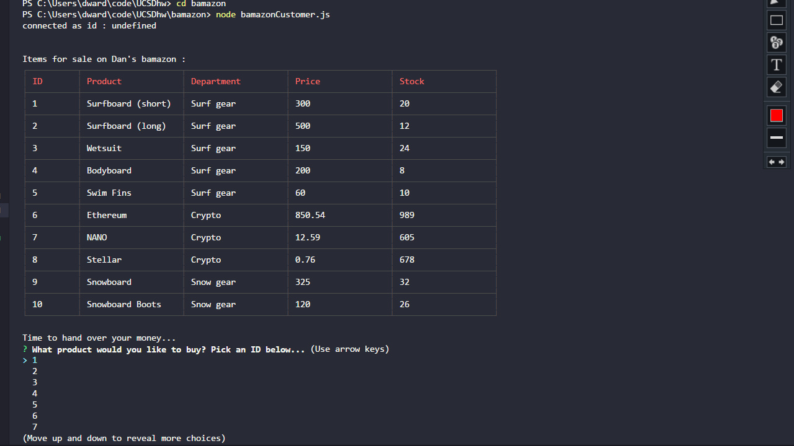
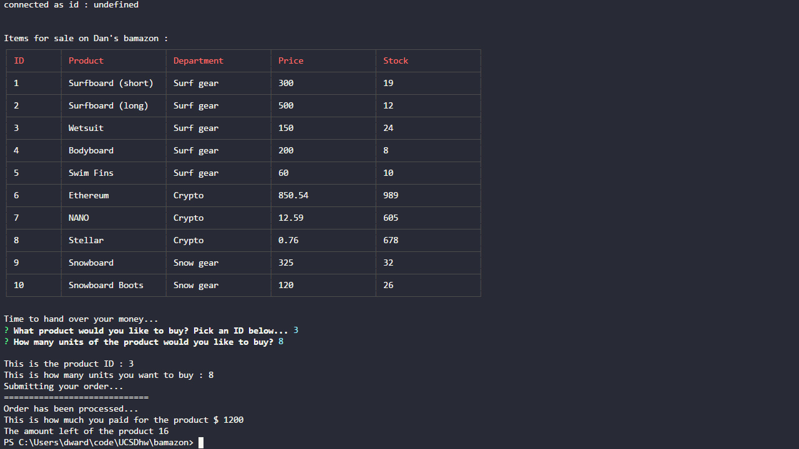

# Dan's Bamazon
A mysql database project using node.js In this project I created a mySql database using VScode and imported it into workbench to create the tables. The objective was too create 3 different challenges. I was able to accomplish 2 out of 3 of the challenges. 

# First Objective
The first challenge involved creating a customer view section that allowed the customer in node.js to access the sql database and view products, search by ID the producted that they wanted to buy. After declaring the quantity amount and the ID the database was updated when the customer bought the product. If their was not enough units available a response would indicate that there is insufficient quantity. 

The amount left of the product will be displayed as well as the price that the customer paid.

# Second Objective

The second challenge involved creating a managerFile that would allow to view inventory, low inventory, add inventory and add new products. Within a inquirer prompt the manager has the option to choose which one he/she would like. When a process was completed a prompt would display asking if they want to continue viewing the options or not. Below is linked to a google dropbox my video for this section.

[Video of second challenge](http://github.com)
